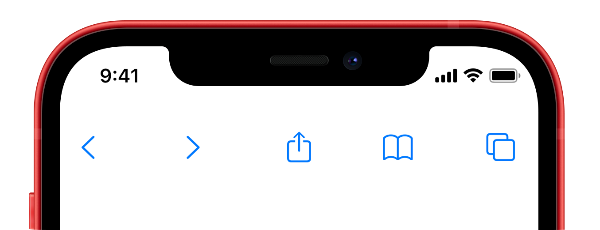

<p align="center">

</p>

<span align="center">
  
[](https://github.com/TimOliver/TOStackView/actions?query=workflow%3ACI)
[](http://cocoadocs.org/docsets/TOStackView)
[](https://raw.githubusercontent.com/TimOliver/TOStackView/master/LICENSE)
[](http://cocoadocs.org/docsets/TOBorderView)
  
</span>

`TOStackView` is a container view that handles laying out
a collection of subviews in a vertical or horizontal alignment. 

It is a very basic version of `UIStackView` that can be used in use cases where the flexibility and complexity of `UIStackView` isn't necessary.

I built this control after I became addicted to the simplicity of `VStack` and `HStack` in SwiftUI, and wanted similar convenience in my UIKit apps, without needing the full complexity of `UIStackView`.

## Features

* Lays out a collection of subviews in a horizontal or vertical alignment.
* Allows for controlling the alignment of the elements on the alternate axis (eg, Left-alignment in vertically stacked elements).
* Provides basic self-sizing functionality.
* Handles baseline alignment of elements that support it, such as SF Symbols images.

## System Requirements
iOS 9.0 and above.

## Installation

**As a CocoaPods Dependency**

Add the following to your Podfile:
```
pod 'TOStackView'
```

**Swift Package Manager**

Will be coming as soon as I get the time! If you can't wait, please consider filing a PR.

**Manual Installation**

Copy the folder `TOStackView` to your Xcode project.

`TOStackView` is an Objective-C project, but it has been written to work properly in Swift as well. If you are using it in a Swift project, don't forget to include it in your Objective-C bridging header.

## Examples

```objc
// Create some content views
UILabel *leftLabel = [[UILabel alloc] init];
leftLabel.text = @"Hello";
[leftLabel sizeToFit];

UILabel *rightLabel = [[UILabel alloc] init];
rightLabel.text = @"Hello";
[rightLabel sizeToFit];

// Create a stack view enclosing the content views
TOStackView *stackView = [[TOStackView alloc] initWithArrangedSubviews:@[leftLabel, rightLabel]];

// Size the stack view to wrap the content views
[stackView sizeToFit];

```

## Credits
`TOStackView` was originally created by [Tim Oliver](http://twitter.com/TimOliverAU) as a component for iComics 2, an upcoming comic reader app for iOS.

iOS Device mockups used in the screenshot created by [Pixeden](http://www.pixeden.com).

## License
`TOStackView` is licensed under the MIT License, please see the [LICENSE](LICENSE) file.
